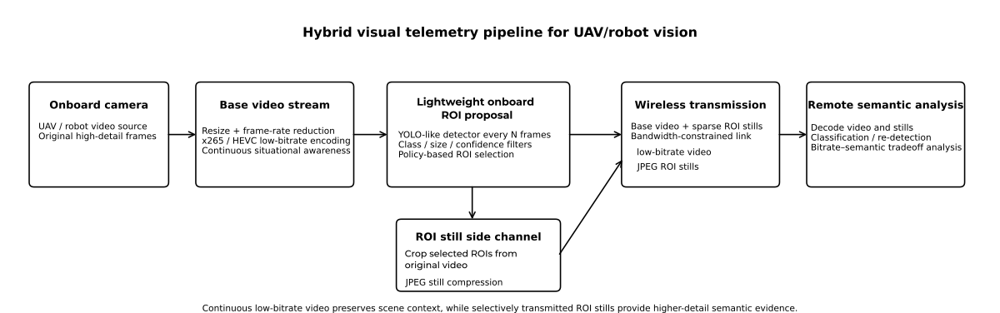
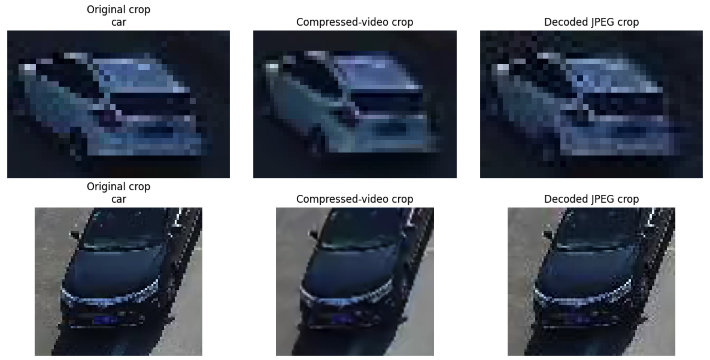
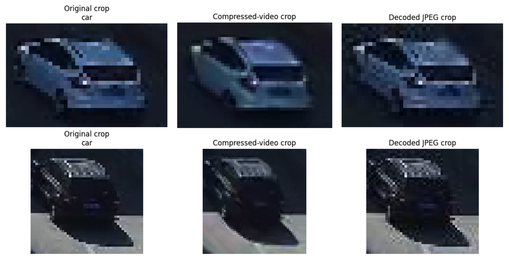

# Hybrid Robotic Vision Notebook Suite

This repository contains the Google Colab notebooks used for the pilot study on **hybrid visual telemetry** for UAVs, drones, and robots.

The core idea is to transmit:

- a **continuous low-bitrate base video stream**, and
- a **sparse side channel of selected ROI still images**

so that the receiver gets both:

- **scene continuity** from the video stream, and
- **higher-detail semantic evidence** from selected still crops.

<p align="center">
  
</p>

<p align="center"><em>Hybrid visual telemetry pipeline: continuous low-bitrate video preserves scene context, while selectively transmitted ROI stills provide higher-detail semantic evidence.</em></p>

The current implementation is a **proof-of-concept / pilot pipeline** intended for reproducible experiments and an arXiv preprint. It is modular by design: each notebook handles one stage of the pipeline and writes explicit manifests for the next stage.

---

## Repository structure

The notebooks are designed around the following Google Drive layout:

```text
MyDrive/
  hybrid_robotic_vision/
    data/
      uavdt/
        videos/
        annotations/
    runs/
    notebooks/
    tools/
```

The `runs/` directory stores all intermediate and final experiment outputs.

---

## Notebook overview

### Notebook 1 — Video encoding baseline
**File:** `hybrid_robotic_vision_pilot_colab.ipynb`

Purpose:
- mount Google Drive
- create the project folder structure
- inspect the dataset
- encode source video into low-bitrate and moderate-bitrate base streams
- save bitrate and file-level metrics

Main outputs:
- encoded base video files
- `video_only_metrics.json`
- `video_only_metrics_summary.csv`

Typical output folders:
```text
runs/
  uavdt_low/
    video_only/
      <sequence_name>/
  uavdt_moderate/
    video_only/
      <sequence_name>/
```

---

### Notebook 2 — YOLO ROI manifest policy sweep
**File:** `hybrid_robotic_vision_yolo_roi_manifest_sweep_colab.ipynb`

Purpose:
- run YOLO on the encoded/base video **once**
- save raw detections
- apply multiple ROI selection policies to the same detections
- map selected ROI coordinates back to original-video space
- save one `roi_manifest.csv` per policy

Current policies:
- `permissive`
- `conf_size_top1`
- `strict_small_only`
- `balanced_top2`

Main outputs:
- shared `detections.csv`
- one `roi_candidates.csv` per policy
- one `roi_manifest.csv` per policy
- `policy_summary.csv`

Typical output folders:
```text
runs/
  yolo_roi_manifest/
    <sequence_name>/
      <regime>/
        raw_detections/
          detections.csv
        policies/
          <policy_name>/
            roi_candidates.csv
            roi_manifest.csv
            run_summary.json
        policy_summary.csv
```

---

### Notebook 3 — ROI still compression with JPEG
**File:** `hybrid_robotic_vision_roi_still_compression_jpeg_colab.ipynb`

Purpose:
- read a selected policy-specific ROI manifest
- reconstruct actual crops from:
  - the original source video
  - the encoded/base video
- compress original crops as **JPEG stills**
- decode JPEGs back to PNG for downstream analysis
- measure per-ROI still-image bitrate

Why JPEG:
- this pilot version is designed to run reliably in Colab
- JPEG is used as a practical still-image codec baseline
- the pipeline can later be adapted to JPEG XL or JPEG AI

Main outputs:
- `original_crops/`
- `compressed_video_crops/`
- `jpeg/`
- `decoded_jpeg/`
- `roi_still_manifest.csv`
- `run_summary.json`

Typical output folders:
```text
runs/
  roi_still_compression_jpeg/
    <sequence_name>/
      <regime>/
        <policy_name>/
          original_crops/
          compressed_video_crops/
          jpeg/
          decoded_jpeg/
          manifests/
            roi_still_manifest.csv
            run_summary.json
```

---

### Notebook 4 — Classification and semantic-gain metrics
**File:** `hybrid_robotic_vision_classification_semantic_gain_colab.ipynb`

Purpose:
- compare the same ROI in two forms:
  - the compressed-video crop
  - the decoded JPEG still
- run a standard ImageNet-pretrained **ResNet-50** classifier on both
- compute semantic proxy metrics for the pilot study

Current semantic-gain metrics:
- `mean_video_conf`
- `mean_still_conf`
- `mean_conf_gain`
- `median_conf_gain`
- `positive_conf_gain_rate`
- `pred_change_rate`
- `small_object_mean_conf_gain`
- `mean_entropy_gain`

Important note:
- these are **proxy semantic metrics**
- they do **not** represent final task-specific classification accuracy
- the current study uses confidence and entropy changes as relative evidence measures

Main outputs:
- `classification_results.csv`
- `semantic_gain_summary.json`
- `run_summary.json`

Typical output folders:
```text
runs/
  classification_semantic_gain/
    <sequence_name>/
      <regime>/
        <policy_name>/
          manifests/
            classification_results.csv
            semantic_gain_summary.json
            run_summary.json
```

---

### Notebook 5 — Bitrate accounting and hybrid system summary
**File:** `hybrid_robotic_vision_bitrate_accounting_summary_colab.ipynb`

Purpose:
- combine outputs from Notebooks 1, 3, and 4
- compute system-level metrics for each `(sequence, regime, policy)` combination
- summarize the bitrate–semantic-gain tradeoff

Current hybrid metrics include:
- `video_bitrate_mbps`
- `roi_bitrate_mbps`
- `hybrid_bitrate_mbps`
- `roi_bitrate_share`
- `num_selected_rois`
- `roi_selection_ratio`
- `frame_roi_coverage`
- `roi_rate_hz`
- `mean_roi_bytes`
- `mean_conf_gain`
- `positive_conf_gain_rate`
- `mean_entropy_gain`
- `conf_gain_per_kb`

Main outputs:
- `hybrid_system_summary.json`
- `hybrid_system_summary.csv`
- `coverage_selection_table.csv`
- `semantic_gain_table.csv`

Typical output folders:
```text
runs/
  hybrid_summary/
    <sequence_name>/
      <regime>/
        <policy_name>/
          hybrid_system_summary.json
          hybrid_system_summary.csv
          coverage_selection_table.csv
          semantic_gain_table.csv
```

---

### Notebook 6 — Results aggregation and paper plots
**File:** `hybrid_robotic_vision_results_plots_colab.ipynb`

Purpose:
- scan all available `hybrid_system_summary.json` files
- aggregate results across sequences, regimes, and policies
- generate paper-ready plots and CSV tables

Current plot outputs include:
- semantic gain vs ROI bitrate
- semantic gain vs ROI bitrate share
- selected ROIs by policy
- positive confidence gain rate by policy
- confidence gain per KB by policy
- entropy gain vs ROI bitrate

Main outputs:
- `aggregated_hybrid_summary.csv`
- `aggregated_policy_summary.csv`
- `paper_policy_comparison_table.csv`
- plot PNG files

Typical output folders:
```text
runs/
  paper_plots/
    aggregated_hybrid_summary.csv
    aggregated_policy_summary.csv
    paper_policy_comparison_table.csv
    plot_*.png
```

---

## Recommended execution order

Run the notebooks in this order:

1. **Notebook 1** — create the encoded base-video streams
2. **Notebook 2** — generate raw detections and policy-specific ROI manifests
3. **Notebook 3** — choose a policy and generate ROI stills
4. **Notebook 4** — compute semantic-gain metrics
5. **Notebook 5** — compute hybrid bitrate and system summary
6. **Notebook 6** — aggregate results and make plots

For policy comparisons:
- run Notebook 2 once
- then rerun Notebooks 3–5 separately for each `POLICY_NAME`

Example policy sweep:
- `permissive`
- `balanced_top2`
- `conf_size_top1`
- `strict_small_only`

---

## Current experimental status

This repository currently reflects a **pilot proof-of-concept implementation**.

What is already implemented:
- low-bitrate HEVC/x265 base stream
- YOLO-based ROI proposal on the encoded stream
- policy-based ROI selection
- JPEG ROI still transmission simulation
- downstream classification comparison
- bitrate accounting
- policy tradeoff analysis

What is intentionally preliminary:
- evaluation is currently based on **proxy semantic metrics**
- the detector is a **general YOLO model**, not a UAV-specific detector
- the classifier is a **general ResNet-50**, not a task-specific aerial classifier
- the current selector is frame-based; stronger temporal suppression / cooldown policies are future work
- JPEG is used as a practical still-image baseline; future work may replace or compare it with JPEG XL or JPEG AI

## Visual evidence — ROI crop quality comparison

The figures below demonstrate the key visual advantage of the hybrid approach. The same detected object (a car) is shown as cropped from:

- the **original source video** (left),
- the **compressed low-bitrate base video** (center), and
- the **separately transmitted JPEG still** (right).

The compressed-video crops suffer from temporal blurring, motion smearing, and loss of fine structure — artifacts inherent to inter-frame video coding at low bitrates. In contrast, the decoded JPEG stills exhibit typical spatial quantization artifacts (blockiness, ringing) but preserve significantly more structural detail and sharper edges, which translates directly into higher classifier confidence.

<p align="center">
  
</p>

<p align="center">
  
</p>

<p align="center"><em>Left: original crop &nbsp;|&nbsp; Center: compressed-video crop &nbsp;|&nbsp; Right: decoded JPEG crop. Video compression introduces motion blur and structural loss; JPEG stills retain sharper detail for downstream classification.</em></p>

---

## Practical notes

### Dataset format
UAVDT is often distributed as frame sequences rather than ready-made video files.  
In this project, experiments are run on per-sequence MP4 files derived from those frames.

### Policy-aware runs
Notebooks 3, 4, and 5 are policy-aware.  
Always verify that `POLICY_NAME` is set consistently across those notebooks.

### Colab execution
These notebooks are written for **Google Colab + Google Drive**.  
Always write outputs to Drive, not only to the temporary Colab filesystem.

### Reproducibility
Each notebook writes explicit manifests and summary JSON files so downstream stages do not have to rerun upstream computation.

---

## Recommended first figures for the paper

After running Notebook 6, the most useful initial figures are:

- `plot_conf_gain_vs_roi_bitrate.png`
- `plot_conf_gain_vs_roi_share.png`
- `plot_selected_rois_low.png`
- `plot_positive_conf_gain_rate_low.png`
- `plot_conf_gain_per_kb_low.png`

These figures show the key bitrate–semantic-gain tradeoffs across ROI policies.

---

## Suggested citation / project description

A short description for the repository:

> This repository contains the experimental notebooks for a pilot study on hybrid visual telemetry for UAV and robotic vision, combining continuous low-bitrate video with selectively transmitted ROI still images to improve semantic utility under bandwidth constraints.

---

## License and future work

This notebook suite is currently intended to accompany an arXiv preprint and will continue to evolve.

Planned future extensions include:
- multi-sequence evaluation
- moderate-bitrate experiments
- label-based evaluation on curated subsets
- temporal ROI suppression / cooldown policies
- alternative still-image codecs
- UAV-specific detectors and classifiers
